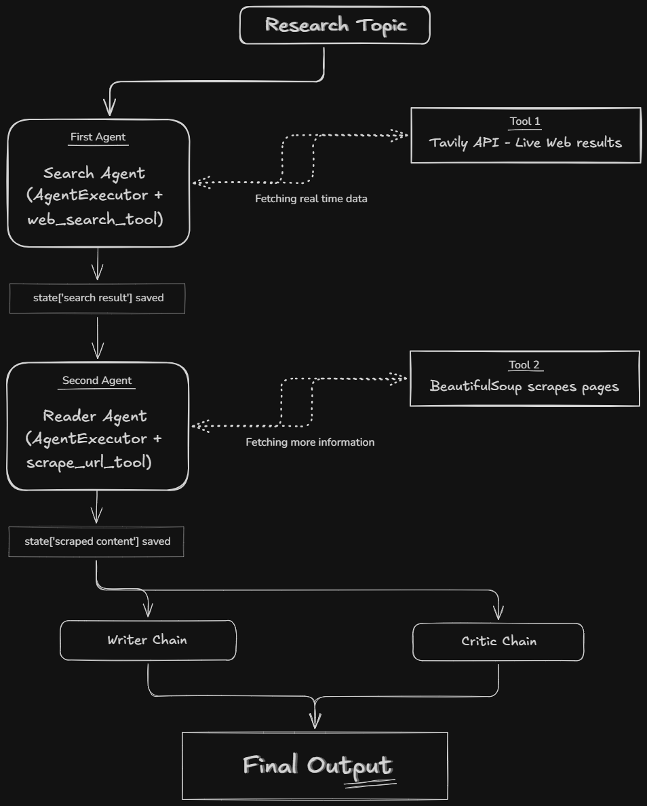

<h1 align="center">🤖 Multi-Agent Research System</h1>

<div align="center"> 
AI-Powered Autonomous Research & Report Generation

<p>     </p>
<p>     </p>

<p> <strong>Search → Read → Write → Critique</strong> </p>

</div>

A modern **AI-powered Multi-Agent Research Assistant** built using **LangGraph**, **LangChain**, **Google Gemini**, **Tavily Search**, **BeautifulSoup**, and **LCEL (LangChain Expression Language)**.

The system automates the complete research workflow—from searching the web and extracting relevant information to generating structured reports and reviewing them using multiple AI agents.

---

## 🚀 Features

- 🔍 AI-powered Web Search using Tavily
- 🌐 Website Content Extraction using BeautifulSoup
- 🤖 Multi-Agent Architecture with LangGraph
- 🧠 Google Gemini LLM Integration
- ✍️ Structured Report Generation
- 📝 AI-powered Report Critique & Feedback
- ⚡ LCEL (LangChain Expression Language) Pipelines
- 📂 Modular & Scalable Project Structure

---

# 🏗️ System Architecture

```
  
```

---

# 📁 Project Structure

```
Multi-Agent-Research/
│
├── agents/
│   ├── __init__.py
│   ├── search_agent.py
│   └── reader_agent.py
│
├── chains/
│   ├── writer.py
│   ├── critic.py
│   └── __init__.py
│
├── prompts/
│   ├── writer_prompt.py
│   └── critic_prompt.py
│
├── tools/
│   ├── __init__.py
│   ├── search_tools.py
│   └── scraper_tools.py
│
├── pipeline/
│   └── research_pipeline.py
│
├── utils/
│   └── helpers.py
│
├── outputs/
│
├── config.py
├── main.py
├── requirements.txt
├── .env
└── README.md
```

---

# 🛠️ Tech Stack

| Category | Technology |
|----------|------------|
| LLM | Google Gemini |
| Agent Framework | LangGraph |
| LLM Framework | LangChain |
| Pipeline | LCEL |
| Search Engine | Tavily API |
| Web Scraping | BeautifulSoup |
| HTTP Requests | Requests |
| Environment | Python Dotenv |
| Output | Markdown Reports |

---

# ⚙️ Installation

## Clone Repository

```bash
git clone https://github.com/animeshraghav/Multi-Agent-Research.git

cd Multi-Agent-Research
```

---

## Create Virtual Environment

```bash
python -m venv .venv
```

Activate:

### Windows

```bash
.venv\Scripts\activate
```

### Linux / macOS

```bash
source .venv/bin/activate
```

---

## Install Dependencies

```bash
pip install -r requirements.txt
```

---

## Configure Environment Variables

Create a `.env` file.

```env
GOOGLE_API_KEY=YOUR_GEMINI_API_KEY
TAVILY_API_KEY=YOUR_TAVILY_API_KEY
```

---

# ▶️ Run the Project

```bash
python main.py
```

Example:

```
Enter Research Topic:

Impact of Artificial Intelligence on Healthcare
```

---

# 🔄 Workflow

1. User enters a research topic.
2. Search Agent gathers recent web resources using Tavily.
3. Reader Agent extracts detailed webpage content.
4. Writer Chain generates a structured research report.
5. Critic Chain reviews the report and suggests improvements.
6. Final report is saved as a Markdown file.

---

# 📌 Example Output

```
Research Topic:
Impact of Artificial Intelligence on Healthcare

✔ Search Completed

✔ Webpages Scraped

✔ Research Report Generated

✔ Critic Feedback Generated

✔ Report Saved
```

---

# 🎯 Future Improvements

- PDF Report Generation
- Parallel Web Scraping
- Citation Management
- Memory-enabled Agents
- RAG Integration
- Vector Database Support
- Multi-source Verification
- Streamlit Web Interface
- FastAPI Backend
- Docker Deployment
- Async Agent Execution
- Human-in-the-loop Review

---

# 📚 Learning Objectives

This project demonstrates:

- Multi-Agent Systems
- LangGraph Workflows
- LangChain Agents
- LCEL Pipelines
- Tool Calling
- AI Research Automation
- Prompt Engineering
- Web Search Integration
- Web Scraping
- Modular AI Architecture

---

# 🤝 Contributing

Contributions are welcome.

1. Fork the repository.
2. Create a new feature branch.
3. Commit your changes.
4. Push the branch.
5. Open a Pull Request.

---

# 📄 License

This project is licensed under the MIT License.

---


⭐ If you found this project useful, consider giving it a star!